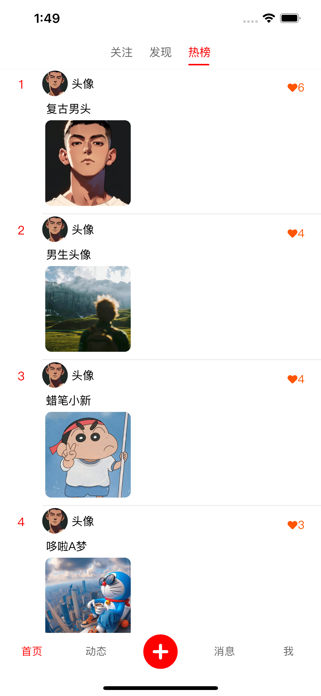

 

<h1 align="center" style="margin: 30px 0 30px; font-weight: bold;">HongShu v1.0</h1>
<h4 align="center">基于 SpringBoot + Vue 前后端分离的仿小红书项目</h4>

	
	
	

## 平台简介
* 前端采用Vue3、Element Plus、Ts、Vite。
* 后端采用SpringBoot、SpringSecurity、WebSocket、Redis、ElasticSearch & Jwt。
* 移动端采用uniapp
* 权限认证使用Jwt，支持多终端认证系统。
* 支持加载动态权限菜单，多方式轻松权限控制。
* 单应用： [HongShu](https://gitee.com/Maverick_Ma/hongshu)
* 网页端，请移步： [HongShu-Web](https://gitee.com/Maverick_Ma/hongshu-web)
* 管理端，请移步： [HongShu-Admin](https://gitee.com/Maverick_Ma/hongshu-admin)
* 移动端，请移步： [HongShu-App](https://gitee.com/Maverick_Ma/hongshu-app)

## 用户端内置功能
1. 笔记：瀑布流按分类展示笔记，懒加载笔记图片
2. 搜索：使用 ElasticSearch 做关键词搜索高亮查询 
3. 动态：展示个人和好友动态 
4. 消息：使用 WebSocket 做私信聊天和消息通知，用户发送消息实时通知、消息页面实时展示当前未读消息数量提醒 
5. 发布：发布和修改笔记功能，使用七牛云oss对象存储图片
6. 用户信息：展示当前用户发布、点赞和收藏的笔记
7. 双 Token 登录机制、无感刷新，使用 Redis 做对象缓存

## 管理端内置功能
1. 用户管理：用户是系统操作者，该功能主要完成系统用户配置。
2. 部门管理：配置系统组织机构（公司、部门、小组），树结构展现支持数据权限。
3. 岗位管理：配置系统用户所属担任职务。
4. 菜单管理：配置系统菜单，操作权限，按钮权限标识等。
5. 角色管理：角色菜单权限分配、设置角色按机构进行数据范围权限划分。
6. 字典管理：对系统中经常使用的一些较为固定的数据进行维护。
7. 参数管理：对系统动态配置常用参数。
8. 通知公告：系统通知公告信息发布维护。
9. 操作日志：系统正常操作日志记录和查询；系统异常信息日志记录和查询。
10. 登录日志：系统登录日志记录查询包含登录异常。
11. 在线用户：当前系统中活跃用户状态监控。
12. 定时任务：在线（添加、修改、删除）任务调度包含执行结果日志。
13. 系统接口：根据业务代码自动生成相关的api接口文档。
14. 服务监控：监视当前系统CPU、内存、磁盘、堆栈等相关信息。
15. 缓存监控：对系统的缓存信息查询，命令统计等。
16. 在线构建器：拖动表单元素生成相应的HTML代码。
17. 连接池监视：监视当前系统数据库连接池状态，可进行分析SQL找出系统性能瓶颈。

## 2.0版本实现功能
1. 添加移动端
2. 重构实现 SpringCloud 微服务架构
3. 加入商城购物功能
4. 加入推荐算法，优化内容推荐和用户推荐功能
5. 使用 MQ+Redis 优化点赞、收藏、浏览功能
6. 支持七牛云、阿里、腾讯、Minio等多种oss对象存储方式
7. 笔记内容支持视频和live图

### ⚠️如有【项目问题】或【部署需求】可联系微信：coder_xiaomage

## 演示站（2.0版）
- web端 ➡️ [点我体验](http://47.95.205.22)
- admin端 ➡️ [点我体验](http://47.95.205.22/admin/)
- app端 ➡️ [点我体验](http://47.95.205.22/app/)
- 文档及资料会暂时放到我的个人博客：[点我进入](https://mayongjian.cn)
* 由于服务器资源有限，首次加载可能缓慢一些。
* 同时为优化服务器也感谢小伙伴们打赏支持❤️。

## 视频演示
➡️ [点击查看](https://www.bilibili.com/video/BV1QP8dekEGq/?spm_id_from=333.999.list.card_archive.click&vd_source=ec9224821314432ac6e12dc7d500d74b)

## 演示图
### - web端：
<table>
    <tr>
        <td></td>
        <td></td>
    </tr>
    <tr>
        <td></td>
        <td></td>
    </tr>
    <tr>
        <td></td>
        <td></td>
    </tr>
	<tr>
        <td></td>
        <td></td>
    </tr>
</table>

### - admin端：
<table>	 
    <tr>
        <td></td>
        <td></td>
    </tr>
	<tr>
        <td></td>
        <td></td>
    </tr>
	<tr>
        <td></td>
        <td></td>
    </tr>
    <tr>
        <td></td>
        <td></td>
    </tr>
</table>

### - app端：
<table>	 
    <tr>
        <td></td>
        <td></td>
    </tr>
	<tr>
        <td></td>
        <td></td>
    </tr>
	<tr>
        <td></td>
        <td></td>
    </tr>
    <tr>
        <td></td>
        <td></td>
    </tr>
    <tr>
        <td></td>
        <td></td>
    </tr>
</table>
