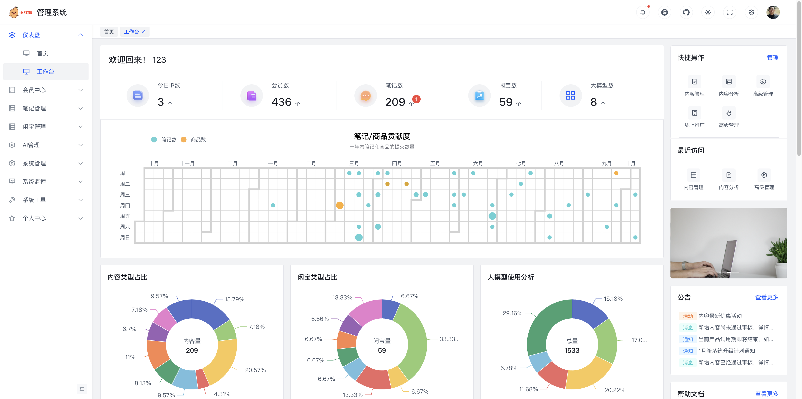
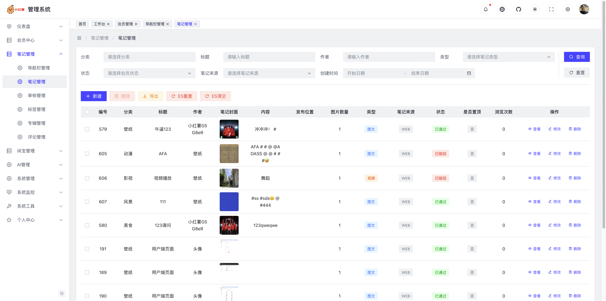
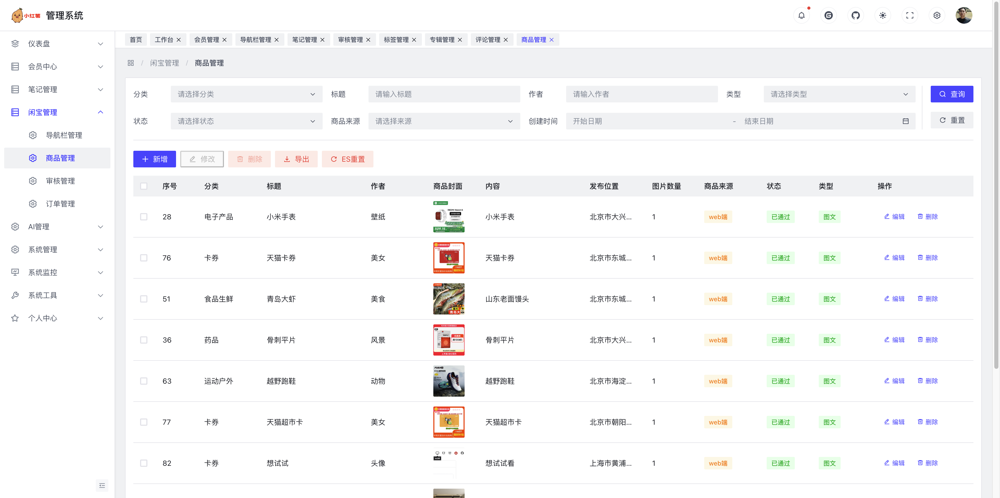

  

<h1 align="center" style="margin: 30px 0 30px; font-weight: bold;">HongShu</h1>

  <b>基于 SpringBoot + Vue + Uniapp + AI大模型 的仿小红书全栈项目</b>

  <i>1:1 高仿小红书，具备内容发布、商品交易、社交互动、算法推荐、即时通讯等核心功能，适合全栈学习与实战。</i>

  
  
  

> **声明**  
> 本项目基于 MIT 协议，免费开源，仅供学习交流，禁止转卖，谨防受骗。如需商用请保留版权信息，确保合法合规使用，运营风险自负，与作者无关。

---

## 🚀 项目简介

HongShu - 一款深度融合 AI 大模型能力的现代化社交电商平台，采用 SpringBoot + Vue + Uniapp 前后端分离架构，完整复刻小红书核心功能，并创新性集成多模态 AI 技术，打造智能化的内容创作与社交体验。

### 🎓 适合人群

| 👨‍💻 **全栈开发者** | 🎯 **求职者** | 🏢 **创业团队** | 📚 **学生党** |
|:---:|:---:|:---:|:---:|
| 学习 SpringBoot + Vue 全栈开发 了解微服务架构设计 掌握前后端分离开发 | 简历项目经验 面试技术亮点 实战能力证明 | 快速搭建社交平台 二次开发定制 商业化落地 | 毕业设计项目 技术栈学习 实战经验积累 |

### 📂 项目组成

| 模块 | 模块说明  | 技术栈 | 项目地址                                                                                                          |
|------|-------|--------|---------------------------------------------------------------------------------------------------------------|
| **[HongShu](https://gitee.com/Maverick_Ma/hongshu)** | 后端服务代码（Java） | SpringBoot + SpringCloud | [gitee](https://gitee.com/Maverick_Ma/hongshu) 、 [github](https://github.com/Ma-YongJian/HongShu)             |
| **[HongShu-Web](https://gitee.com/Maverick_Ma/hongshu-web)** | Web端代码（Vue） | Vue3 + Element Plus + TypeScript | [gitee](https://gitee.com/Maverick_Ma/hongshu-web) 、 [github](https://github.com/Ma-YongJian/HongShu-Web)     |
| **[HongShu-Admin](https://gitee.com/Maverick_Ma/hongshu-admin)**  | 管理端代码（Vue） | Vue3 + Arco Design + Vite | [gitee](https://gitee.com/Maverick_Ma/hongshu-admin) 、 [github](https://github.com/Ma-YongJian/HongShu-Admin) |
| **[HongShu-App](https://gitee.com/Maverick_Ma/hongshu-app)** | 移动端Uniapp代码 | Uniapp + Vue3（支持App/小程序/H5） | [gitee](https://gitee.com/Maverick_Ma/hongshu-app) 、 [github](https://github.com/Ma-YongJian/HongShu-App)     |

### 🏗️ 技术选型

<table>
<tr>
<td width="33%">

#### 后端技术栈
- **框架**：SpringBoot 3.x、SpringCloud
- **注册中心**：Nacos
- **数据库**：MySQL 8.x、MyBatis-Plus
- **缓存**：Redis 7.x
- **搜索**：ElasticSearch 8.x
- **消息队列**：RocketMQ
- **即时通讯**：WebSocket、Netty
- **AI集成**：OpenAI SDK、多模型适配

</td>
<td width="33%">

#### 前端技术栈
- **框架**：Vue3 + TypeScript
- **构建工具**：Vite 4.x
- **UI组件**：Element Plus、Arco Design
- **移动端**：Uniapp（支持微信小程序）
- **状态管理**：Pinia
- **网络请求**：Axios
- **富文本**：WangEditor
- **地图**：高德地图

</td>
<td width="33%">

#### 基础设施
- **容器化**：Docker、Docker Compose
- **反向代理**：Nginx
- **对象存储**：Minio、七牛云、阿里云、腾讯云
- **短信服务**：阿里云、腾讯云、云片
- **支付**：支付宝沙箱
- **监控**：SpringBoot Admin
- **文档**：Swagger

</td>
</tr>
</table>

---

## 🌟 项目特色

| 功能模块      | 技术实现                                                            | 创新点                             |
|-----------|-----------------------------------------------------------------|---------------------------------|
| 🎯 智能推荐   | 轻量级推荐 + 协同过滤 + ES检索 动态切换                                       | ✅ 三套算法、新用户优化、性能<100ms         |
| 💬 即时通讯   | WebSocket + Netty + RocketMQ                                    | ✅ 离线消息、多端同步、高并发支持             |
| 🏪 社交电商   | 笔记种草 + 商品转化 + 在线支付                                             | ✅ 价格区间推荐、同城优先、闭环转化           |
| 🔥 高并发优化  | Redis + RocketMQ 双通道 + 批量落库                                    | ✅ 性能提升20倍、数据库压力降低90%          |
| 🤖 AI大模型  | ChatGPT + DeepSeek + 多模型适配                                     | ✅ 8+模型支持、智能创作、对话系统            |
| 🔐 安全认证   | 双Token无感刷新 + JWT                                               | ✅ 用户无感知、安全可靠                  |
| ☁️ 多云存储   | 本地 + Minio + 七牛云 + 阿里云 + 腾讯云                                   | ✅ 动态切换、后台配置                    |
| 🔍 智能搜索   | ElasticSearch + MySQL 双引擎                                      | ✅ 多字段权重、模糊匹配                  |
| 📍 LBS定位  | 高德地图 + IP定位                                                    | ✅ 同城推荐、附近内容                    |
| 💳 在线支付   | 支付宝沙箱支付                                                         | ✅ 完整支付流程                       |
| 📱 多端适配   | Web + App + 小程序                                                | ✅ 代码复用、统一API                   |
| 📊 数据统计   | 用户增长、内容统计、交易分析                                                  | ✅ 可视化图表、实时监控                  |

---

## 📅 版本演进
> `💡 点击下方版本号可展开查看版本详情`
>  [如需 Pro 版源码，👉点击获取](https://www.yuque.com/xiaomage-ippj7/kaoqwn/rqslw69egcbgx7v7?singleDoc#)

<b>v1.0（Lite版）</b>- 基础功能

- ✅ ES 智能查询
- ✅ 笔记随机推荐
- ✅ 图文笔记发布
- ✅ 本地存储、七牛云存储
- ✅ 基础审核机制

<b>v2.0（Pro版）</b>- 移动端 + 协同过滤

- ✅ Uniapp 移动端（App + H5）
- ✅ 视频笔记支持
- ✅ Live Photo（动态图片）
- ✅ 多云存储方案（动态配置）
- ✅ 协同过滤推荐

<b>v3.0（Pro版）</b>- 微服务 + 社交电商

- ✅ SpringCloud 微服务架构
- ✅ Nacos 配置中心
- ✅ Netty 即时通讯系统
- ✅ 闲置商城（社交电商融合）
- ✅ 高德地图 LBS 定位
- ✅ Redis + RocketMQ 高并发优化
- ✅ WebSocket 离线消息推送

<b>v4.0（Pro版）</b>- AI + 小程序 + 轻量级推荐

- ✅ 8+ 主流AI大模型集成
- ✅ 智能对话系统
- ✅ AI辅助创作
- ✅ 微信小程序上线
- ✅ Arco Design 新版管理后台
- ✅ **轻量级推荐算法**（自研）
    - 四维度混合召回
    - 性能<100ms

---

## 🌐 演示站（微服务版本 - 演进更新）

> 💡 **温馨提示**: 服务器配置有限，如遇访问缓慢请耐心等待
> `小龟速服务器正在奔跑中...`

| 端类型 | 访问方式                                                                           | 功能说明 | 推荐指数 |
|--------|--------------------------------------------------------------------------------|--------|---------|
| **Web端** | [点击访问](https://hongshu.website/) | 完整功能体验，PC最佳 | ⭐⭐⭐⭐⭐ |
| **管理端** | [点击访问](https://hongshu.website/admin/) | 传统后台管理 | ⭐⭐⭐⭐ |
| **Arco管理端** | [点击访问](https://hongshu.website/arco-admin/) | 现代化管理界面 | ⭐⭐⭐⭐⭐ |
| **移动端(H5)** | [点击访问](https://hongshu.website/app/) 或  | 移动端最佳体验 | ⭐⭐⭐⭐⭐ |
| **微信小程序** | 体验版  | 小程序生态 | ⭐⭐⭐⭐⭐ |

---

## 📞 联系与支持

<table>
<tr>
<td align="center" width="33%">

#### 🤝 项目定制 & 部署

- 项目部署指导
- 功能定制开发
- 技术咨询支持
- Bug修复服务

</td>
<td align="center" width="33%">

#### 💬 技术交流群

- 技术问题解答
- 学习资料分享
- 项目更新通知
- 优先内测资格

</td>
<td align="center" width="33%">

#### 💖 打赏支持

**您的支持是我前进的动力！**
- 升级服务器配置
- 持续功能开发
- 提升访问速度
- 更好的开源体验

</td>
</tr>
</table>

---

## 📦 项目地址

- **Gitee**: [https://gitee.com/Maverick_Ma/hongshu](https://gitee.com/Maverick_Ma/hongshu) （⭐ Star支持）
- **Github**: [https://github.com/Ma-YongJian/HongShu](https://github.com/Ma-YongJian/HongShu) （⭐ Star支持）

> **❤️ 如果这个项目对您有帮助，欢迎 Star & Fork 支持一下！** **您的 Star 是对我最大的鼓励！** 🌟

## 📚 项目文档

- [部署文档](https://www.yuque.com/xiaomage-ippj7/kaoqwn/zdgtgrco82vftbot?singleDoc#)
- [核心亮点文档](https://www.yuque.com/xiaomage-ippj7/kaoqwn/chm8w6thvrmtnmbk)

## 🎬 视频演示

- [演示视频](https://www.bilibili.com/video/BV1dr7Gz9E53/?vd_source=ec9224821314432ac6e12dc7d500d74b)

---

## 📷 演示图

### Web端

<table>
  <tr>
    <td></td>
    <td></td>
    <td></td>
  </tr>
  <tr>
    <td></td>
    <td></td>
    <td></td>
  </tr>
  <tr>
    <td></td>
    <td></td>
    <td></td>
  </tr>
  <tr>
    <td></td>  
    <td></td>
    <td></td>
  </tr>
  <tr>
  </tr>
</table>

### 管理端

<table>
  <tr>
    <td></td>
    <td></td>
    <td></td>
  </tr>
  <tr>
    <td></td>
    <td></td>
    <td></td>
  </tr>
  <tr>
    <td></td>
    <td></td>
    <td></td>
  </tr>
  <tr>
    <td></td>
    <td></td>
    <td></td>
  </tr>
</table>

### App端

<table>
  <tr>
    <td></td>
    <td></td>
    <td></td>
    <td></td>
  </tr>
  <tr>
    <td></td>
    <td></td>
    <td></td>
    <td></td>
  </tr>
  <tr>
    <td></td>
    <td></td>
    <td></td>
    <td></td>
  </tr>
</table>

## 🙏 致谢

- [若依 RuoYi](https://gitee.com/y_project/RuoYi)
- [蘑菇博客](https://gitee.com/moxi159753/mogu_blog_v2)
- [xiaozhao 仿小红书前端](https://gitee.com/xzjsccz/xiaohongshu)
- [Chat MASTER](https://gitee.com/panday94/chat-master)
- 感谢 [七牛云](https://portal.qiniu.com/signup?utm_source=kaiyuan&utm_media=mogu) 提供的免费云存储和CDN服务
- 感谢 [jetbrains](https://www.jetbrains.com/?from=mogu_blog_v2) 提供的开源License
