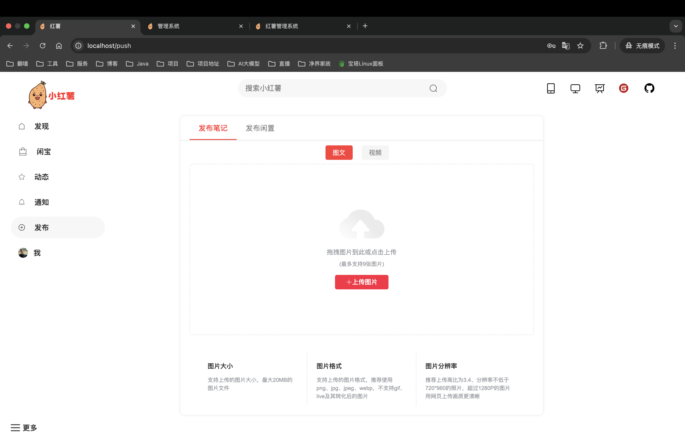
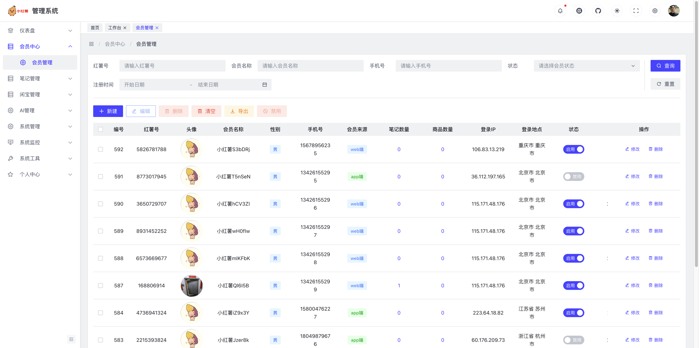
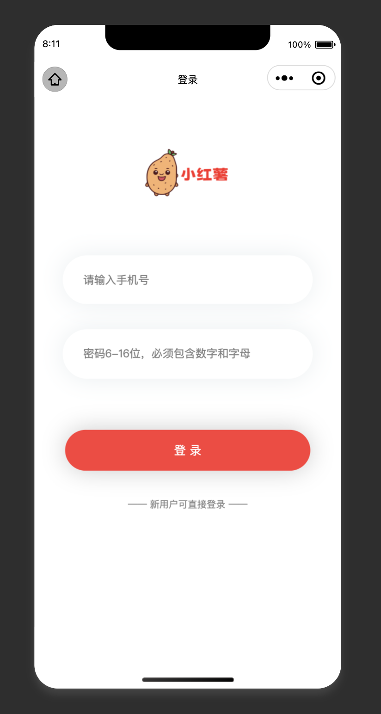
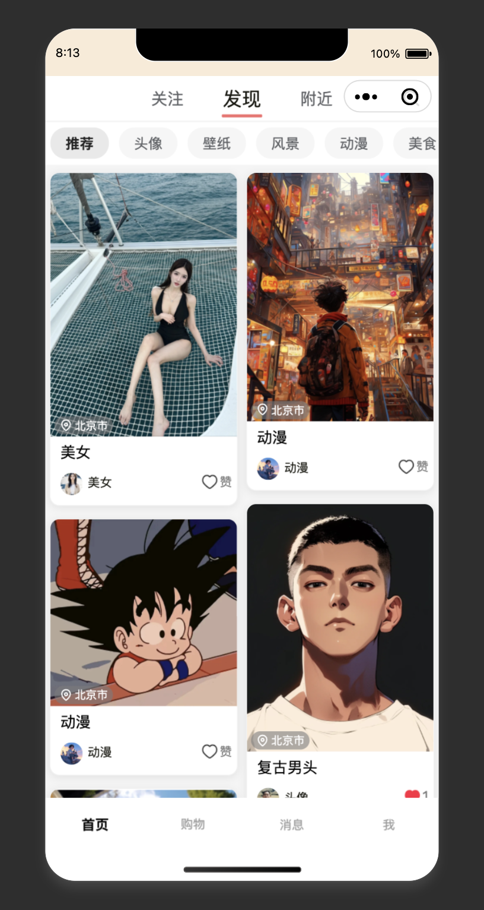
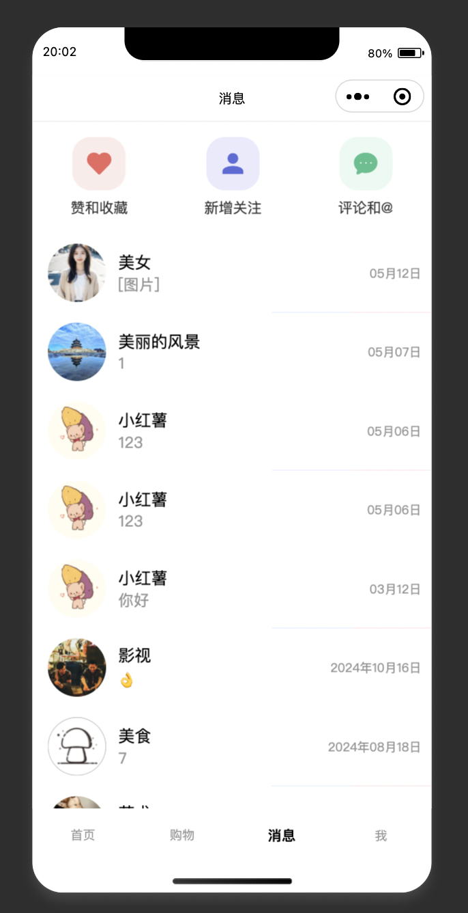
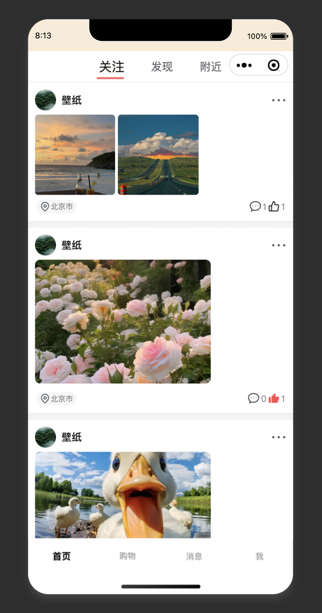

 

<h1 align="center" style="margin: 30px 0 30px; font-weight: bold;">HongShu</h1>
<h4 align="center">基于SpringBoot+Vue前后端分离的仿小红书项目</h4>

	
	
	

> 声明：此项目发布于Gitee、GitCode和GitHub，基于 Apache 协议，免费且作为开源学习使用，禁止转卖、谨防受骗。如需商用必须保留版权信息，请自觉遵守。确保合法合规使用，在运营过程中产生的一切任何后果自负，与作者无关。

> 🎉移动端因重构，原版本`¥99`可获取学习🎉

## 项目简介
基于 SpringBoot + Vue 前后端分离的仿小红书系统，1:1 还原小红书页面及功能。本项目采用当下最主流的前后端分离架构，前端使用 Vue3 + TypeScript 开发，后端采用 SpringBoot 框架。项目完整还原了小红书的核心功能，包括内容发布、社交互动、私信聊天、搜索发现等模块，致力于打造一个功能完善、体验流畅的社交分享平台。
* [HongShu](https://gitee.com/Maverick_Ma/hongshu) ｜ 本项目为单应用版本 
* [HongShu-Web](https://gitee.com/Maverick_Ma/hongshu-web) ｜ 用户端采用Vue3、ts、Element UI。
* [HongShu-Admin](https://gitee.com/Maverick_Ma/hongshu-admin) ｜ 管理端采用Vue3、Vite、Element UI。
* [HongShu-App](https://gitee.com/Maverick_Ma/hongshu-app) ｜ 移动端采用uniapp。

## 项目背景
小红书作为当下最受欢迎的生活方式分享社区，拥有海量的用户群体和丰富的内容生态。本项目旨在通过技术手段还原小红书的核心功能，不仅可以学习到完整的全栈开发流程，还能深入理解大型社交平台的架构设计和业务实现。

## 项目特色
* 瀑布流展示笔记、懒加载笔记图片、视频
* 使用 Redis 做对象缓存
* 使用 ElasticSearch 做智能查询
* 使用 WebSocket 实现即时通讯，支持私信聊天，关注、评论、点赞和收藏等功能，消息页面实时显示用户未读消息数量
* 双Token登陆机制
* 支持多种存储方式：本地、Minio、七牛云、腾讯云、阿里云存储等

## 功能迭代
### - 1.0 版本功能
1. ES智能查询、笔记随机推荐
2. 笔记支持图文类型
3. 本地存储、七牛云存储
4. 审核机制

### - 2.0 版本功能
1. 新增uniapp移动端
2. 笔记支持视频和live图类型
3. 新增七牛云、阿里云、腾讯云等多种OSS对象存储方式，可动态配置
4. 加入协同过滤算法实现推荐功能

### - 3.0 版本功能
1. 重构实现 springCloud 微服务架构版本，采用 Nacos 作为服务发现和配置中心，轻松完成项目的配置的维护
2. 引入Arco-Design字节提供的前端UI实现新的后台管理页面
3. 引入高德地图
4. 加入闲置商城购物功能
5. 使用netty重构消息聊天
6. 使用 MQ+Redis 优化点赞、收藏、浏览功能

## 说明:
1. 后续会更新维护`单体版（springBoot）`、`微服务版（springCloud）`两个版本，演示站部署`微服务版`
2. 由于微信小程序每次发布审核过于严苛和繁琐，暂时不再提供体验环境，但uniapp端依然会继续兼容小程序
3. 演示站部署的是微服务版本，与开源版本功能存在一定差异，具体请参考:

- 移动端因重构，原版本`¥99`可获取学习
- 目前，微服务版源码暂未开源，若需要可添加微信获取 👇
- 如有`项目问题`、`项目定制`、`部署需求`也可微信联系 👇

  

## 演示站（微服务版本-持续更新）
- 【web端】 ☞️ [点我进入](http://115.190.73.103)
- 【管理端】 ☞️ [点我进入](http://115.190.73.103/admin/)
- 【移动端】 ☞️ [点我进入](http://115.190.73.103/app/) 或 扫码体验👇: 

  

* 也感谢小伙伴们打赏支持用于升级服务器❤️

  

## 技术选型
* 系统架构图

## 项目地址
目前项目托管在 Gitee 和 Github 平台上中，欢迎大家 Star 和 Fork 支持~
- Gitee地址：https://gitee.com/Maverick_Ma/hongshu
- Github地址：https://github.com/Ma-YongJian/HongShu

## 项目文档
* 文档及资料会暂时放到我的个人博客：☞ [点我进入](https://mayongjian.cn)

## 视频演示
- [点击查看](https://www.bilibili.com/video/BV1QP8dekEGq/?spm_id_from=333.999.list.card_archive.click&vd_source=ec9224821314432ac6e12dc7d500d74b)

## 致谢
红薯项目参考了很多开源项目的解决方案，开源不易，感谢分享
- 感谢 [若依](https://gitee.com/y_project/RuoYi) 提供的 RuoYi 项目：https://gitee.com/y_project/RuoYi
- 感谢 [xiaozhao](https://gitee.com/xzjsccz/xiaohongshu) 提供的前端仿小红书源码：https://gitee.com/xzjsccz/xiaohongshu
- 感谢 [陌溪](https://gitee.com/moxi159753/mogu_blog_v2) 提供的 蘑菇博客 项目：https://gitee.com/moxi159753/mogu_blog_v2
- 感谢 [七牛云](https://portal.qiniu.com/signup?utm_source=kaiyuan&utm_media=mogu) 提供的免费云存储和CDN服务
- 感谢 [jetbrains](https://www.jetbrains.com/?from=mogu_blog_v2) 提供的开源License

## 演示图
* web端：
<table>
    <tr>
        <td></td>
        <td></td>
    </tr>
    <tr>
        <td></td>
        <td></td>
    </tr>
    <tr>
        <td></td>
        <td></td>
    </tr>
	<tr>
        <td></td>
        <td></td>
    </tr>
    <tr>
        <td></td>
        <td></td>
    </tr>
    <tr>
        <td></td>
        <td></td>
    </tr>
</table>

* 管理端：
<table>	 
    <tr>
        <td></td>
        <td></td>
    </tr>
	<tr>
        <td></td>
        <td></td>
    </tr>
	<tr>
        <td></td>
        <td></td>
    </tr>
    <tr>
        <td></td>
        <td></td>
    </tr>
</table>

* app端：
<table>	 
    <tr>
        <td></td>
        <td></td>
    </tr>
    <tr>
        <td></td>
        <td></td>
    </tr>
	<tr>
        <td></td>
        <td></td>
    </tr>
	<tr>
        <td></td>
        <td></td>
    </tr>
    <tr>
        <td></td>
        <td></td>
    </tr>
    <tr>
        <td></td>
        <td></td>
    </tr>
</table>
