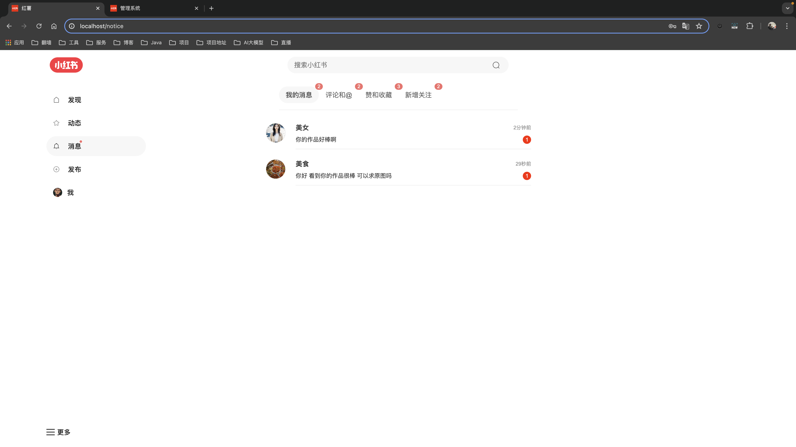
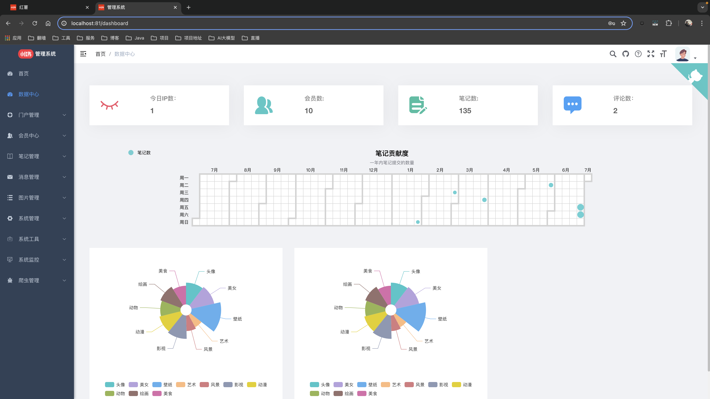

 

<h1 align="center" style="margin: 30px 0 30px; font-weight: bold;">HongShu v1.0</h1>
<h4 align="center">基于SpringBoot+Vue前后端分离仿小红书项目</h4>

	
	
	

## 平台简介

* 前端采用Vue、Element UI。
* 后端采用Spring Boot、Spring Security、Redis & Jwt。
* 权限认证使用Jwt，支持多终端认证系统。
* 支持加载动态权限菜单，多方式轻松权限控制。
* 提供了技术栈（[Vue3](https://v3.cn.vuejs.org) [Element Plus](https://element-plus.org/zh-CN) [Vite](https://cn.vitejs.dev)）
* 单应用版本 [HongShu](https://gitee.com/Maverick_Ma/hongshu)
* 微服务版本，请移步 [HongShu-Cloud](https://gitee.com/Maverick_Ma/hongshu-cloud)
* 阿里云优惠券：[点我领取](https://www.aliyun.com/minisite/goods?source=5176.11533457&userCode=ojvsntx1)
* 腾讯云优惠券：[点我领取](https://curl.qcloud.com/efTJbNyi)

## 用户端内置功能
1. 瀑布流展示笔记，懒加载笔记图片
2. 笔记分类查询，使用 ElasticSearch 做关键词搜索查询笔记
3. 关键词使用 ElasticSearch 做高亮查询
4. 动态展示，展示个人和好友动态
5. 支持私信聊天，关注用户，评论笔记，点赞笔记和点赞图片功能，收藏笔记功能
6. 使用 WebSocket 消息通知，用户发送的消息会实时通知，消息页面会实时收到当前用户未读消息数量
7. 双token登陆，使用 Redis 做对象缓存
8. 发布和修改笔记功能，使用七牛云oss对象存储图片
9. 个人信息展示，展示当前用户发布的笔记和点赞收藏的笔记

## 管理端内置功能
1. 用户管理：用户是系统操作者，该功能主要完成系统用户配置。
2. 部门管理：配置系统组织机构（公司、部门、小组），树结构展现支持数据权限。
3. 岗位管理：配置系统用户所属担任职务。
4. 菜单管理：配置系统菜单，操作权限，按钮权限标识等。
5. 角色管理：角色菜单权限分配、设置角色按机构进行数据范围权限划分。
6. 字典管理：对系统中经常使用的一些较为固定的数据进行维护。
7. 参数管理：对系统动态配置常用参数。
8. 通知公告：系统通知公告信息发布维护。
9. 操作日志：系统正常操作日志记录和查询；系统异常信息日志记录和查询。
10. 登录日志：系统登录日志记录查询包含登录异常。
11. 在线用户：当前系统中活跃用户状态监控。
12. 定时任务：在线（添加、修改、删除）任务调度包含执行结果日志。
13. 系统接口：根据业务代码自动生成相关的api接口文档。
14. 服务监控：监视当前系统CPU、内存、磁盘、堆栈等相关信息。
15. 缓存监控：对系统的缓存信息查询，命令统计等。
16. 在线构建器：拖动表单元素生成相应的HTML代码。
17. 连接池监视：监视当前系统数据库连接池状态，可进行分析SQL找出系统性能瓶颈。

## 2.0版本实现中⚠️
1. 添加移动端版本
2. 重构实现 SpringCloud 微服务架构版本
3. 加入商城购物功能
4. 加入协同过滤算法优化首页推荐功能
5. 使用 MQ+Redis 优化点赞、收藏、浏览功能

- 如有项目问题、部署问题可联系微信：coder_xiaomage

## 在线体验
- web端 ➡️ [点我进入](http://47.95.205.22)
- 管理端 ➡️ [点我进入](http://47.95.205.22/admin/)
- app端 ➡️ [点我进入](http://47.95.205.22/app/)
* 由于服务器资源有限，加载可能缓慢。
* 同时也感谢小伙伴们打赏支持❤️。
  
* 文档及资料会暂时放到我的个人博客：[点我进入](https://mayongjian.cn)

## 视频演示
[点击查看](https://www.bilibili.com/video/BV1QP8dekEGq/?spm_id_from=333.999.list.card_archive.click&vd_source=ec9224821314432ac6e12dc7d500d74b)

## 演示图
<table>
    <tr>
        <td></td>
        <td></td>
    </tr>
    <tr>
        <td></td>
        <td></td>
    </tr>
    <tr>
        <td></td>
        <td></td>
    </tr>
	<tr>
        <td></td>
        <td></td>
    </tr>	 
    <tr>
        <td></td>
        <td></td>
    </tr>
	<tr>
        <td></td>
        <td></td>
    </tr>
	<tr>
        <td></td>
        <td></td>
    </tr>
    <tr>
        <td></td>
        <td></td>
    </tr>
</table>
