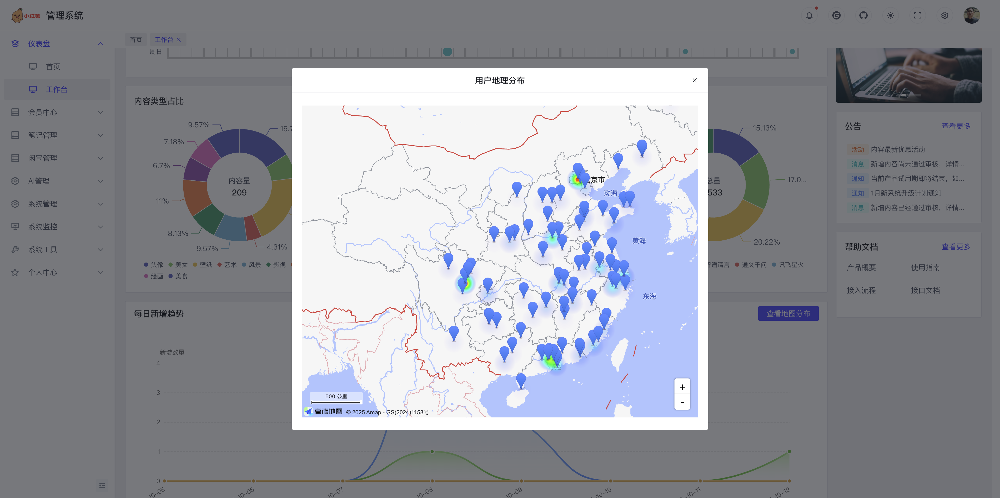
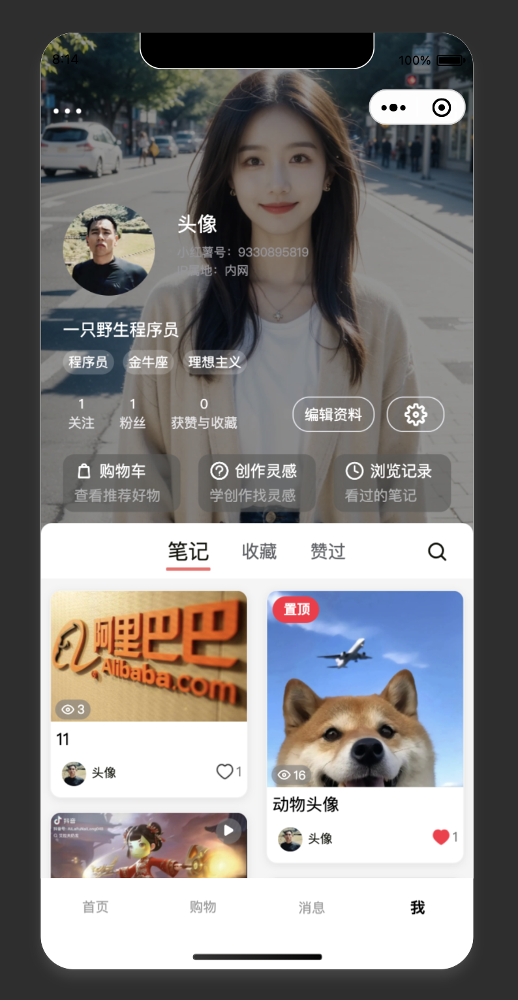

  

<h1 align="center" style="margin: 30px 0 30px; font-weight: bold;">HongShu</h1>

  <b>基于 SpringBoot + Vue + Uniapp + AI 大模型的仿小红书全栈项目</b>

  <i>一款高仿小红书的全栈开源项目，支持内容发布、商品交易、社交互动、即时通讯等核心功能，适合全栈学习与实战。</i>

  
  
  

> **声明**  
> 本项目基于 MIT 协议，免费开源，仅供学习交流，禁止转卖，谨防受骗。如需商用请保留版权信息，确保合法合规使用，运营风险自负，与作者无关。

---

## 🚀 项目简介

HongShu - 一款深度融合 AI 大模型能力的现代化社交电商平台，采用 SpringBoot + Vue + Uniapp 前后端分离架构，完整复刻小红书核心功能，并创新性集成多模态 AI 技术，打造智能化的内容创作与社交体验。

### 📂 项目组成

| 模块 | 模块说明  | 技术栈 | 项目地址                                                                                                          |
|------|-------|--------|---------------------------------------------------------------------------------------------------------------|
| **[HongShu](https://gitee.com/Maverick_Ma/hongshu)** | 后端服务代码（Java） | SpringBoot | [Gitee](https://gitee.com/Maverick_Ma/hongshu) 、 [github](https://github.com/Ma-YongJian/HongShu)             |
| **[HongShu-Web](https://gitee.com/Maverick_Ma/hongshu-web)** | web端代码（vue） | Vue3 + Element Plus | [Gitee](https://gitee.com/Maverick_Ma/hongshu-web) 、 [github](https://github.com/Ma-YongJian/HongShu-Web)     |
| **[HongShu-Admin](https://gitee.com/Maverick_Ma/hongshu-admin)**  | 管理端代码（vue） | Vue3 + Vite | [Gitee](https://gitee.com/Maverick_Ma/hongshu-admin) 、 [github](https://github.com/Ma-YongJian/HongShu-Admin) |
| **[HongShu-App](https://gitee.com/Maverick_Ma/hongshu-app)** | 移动端uniapp代码， 支持app、小程序、H5 | Uniapp | [Gitee](https://gitee.com/Maverick_Ma/hongshu-app) 、 [github](https://github.com/Ma-YongJian/HongShu-App)     |

### 🏗️ 技术选型

- 后端：SpringBoot、SpringCloud、Nacos、Redis、ElasticSearch、MySQL
- 前端：Vue3、TypeScript、Element UI、Vite、uniapp
- 消息：WebSocket、Netty、MQ
- 存储：本地、Minio、七牛云、腾讯云、阿里云
- 短信：阿里云、腾讯云、云片
- 地图：高德地图
- AI大模型：ChatGPT、DeepSeek、豆包、文心一言、通义千问、Kimi、讯飞星火等
---

## 🌟 项目特色

| 功能模块      | 技术实现                       |
|-----------|----------------------------|
| 智能推荐      | ElasticSearch + 协同过滤算法     |
| 即时通讯      | WebSocket + Netty          |
| 多端存储方案    | Minio/七牛云/阿里云/腾讯云OSS动态切换   |
| 高并发优化     | Redis + MQ 消息队列            |
| 安全认证      | 双Token无感刷新机制               |
| 数据双通道同步机制 | 实时写入机制、定时更新机制              |
| 社交与电商融入   | 打通商品和社交通道，实现种草分享，链接购买      |
| AI大模型交互   | 融入ChatGPT、DeepSeek等主流AI大模型 |

---

## 📅 版本演进
> 💡 点击下方版本号可展开查看演进详情

<b>v1.0（Lite版）</b>

- ES 智能查询、笔记随机推荐
- 笔记支持图文类型
- 本地存储、七牛云存储
- 审核机制

<b>v2.0（Pro版）</b>

- 新增 uniapp 移动端
- 笔记支持视频和 live 图类型
- 新增多种 OSS 存储方式，可动态配置
- 协同过滤算法推荐

<b>v3.0（Pro版）</b>

- 重构为 springCloud 微服务架构，Nacos 配置中心
- 引入高德地图
- 闲置商城购物功能
- Netty 重构消息聊天
- MQ+Redis 优化点赞、收藏、浏览

<b>v4.0（Pro版）</b>

- 新增AI大模型
- 上线微信小程序
- Arco-Design实现新的后台管理系统

> 👉 [点击获取 Pro 版完整源码](https://www.yuque.com/xiaomage-ippj7/kaoqwn/rqslw69egcbgx7v7?singleDoc#)

---

## 🌐 演示站（微服务版本 - 演进更新）

> 💡 **温馨提示**: 服务器配置有限，如遇访问缓慢请耐心等待
> `小龟速服务器正在奔跑中...`

| 端类型 | 访问方式                                                                           | 备注 |
|--------|--------------------------------------------------------------------------------|------|
| Web端 | [点击访问](http://115.190.73.103)                                                  | 完整功能体验 |
| 管理端 | [点击访问](http://115.190.73.103/admin/)                                           | 后台管理系统 |
| Arco管理端 | [点击访问](http://115.190.73.103/arco-admin/)                                      | 新版管理界面 |
| 移动端(H5) | [点击访问](http://115.190.73.103/app/) 或  | 扫码体验 |
| 微信小程序 | 体验版                                | 扫码体验 |
---

## 📞 联系与支持

<table>
<tr>
<td align="center" width="50%">

#### 🤝 项目定制 & 部署

微信联系

</td>
<td align="center" width="50%">

#### 💬 技术交流

QQ交流群

</td>
</tr>
</table>

---

## 📦 项目地址

- Gitee: [https://gitee.com/Maverick_Ma/hongshu](https://gitee.com/Maverick_Ma/hongshu)
- Github: [https://github.com/Ma-YongJian/HongShu](https://github.com/Ma-YongJian/HongShu)

> **欢迎 Star & Fork 支持项目一下！**

---

## 📚 项目文档

- [部署文档](https://www.yuque.com/xiaomage-ippj7/kaoqwn/zdgtgrco82vftbot?singleDoc#)

---

## 🎬 视频演示

- [Bilibili 演示视频](https://www.bilibili.com/video/BV1dr7Gz9E53/?vd_source=ec9224821314432ac6e12dc7d500d74b)

---

## 💖 打赏支持

当前服务器配置有限（2核4G），偶尔会有加载缓慢的情况。
感谢小伙伴们打赏支持用于升级服务器❤️

---

## 🛠️ 快速开始

详见 [项目文档](https://www.yuque.com/xiaomage-ippj7/kaoqwn/zdgtgrco82vftbot?singleDoc# )，或参考各子项目 README 进行本地部署体验。

- Q: 如何本地运行？
  A: 详见各子项目 README 或 [项目文档](https://www.yuque.com/xiaomage-ippj7/kaoqwn/zdgtgrco82vftbot?singleDoc# )。
- Q: 依赖环境有哪些？
  A: JDK 8+、Node 16+、MySQL 8+、Redis 7+ 、Elasticsearch 8+等。
- Q: 数据库脚本在哪里？
  A: 见后端项目 `doc/sql` 目录。

---

## 📷 演示图

### Web端

<table>
  <tr>
    <td></td>
    <td></td>
    <td></td>
  </tr>
  <tr>
    <td></td>
    <td></td>
    <td></td>
  </tr>
  <tr>
    <td></td>
    <td></td>
    <td></td>
  </tr>
  <tr>
    <td></td>  
    <td></td>
    <td></td>
  </tr>
  <tr>
  </tr>
</table>

### 管理端

<table>
  <tr>
    <td></td>
    <td></td>
    <td></td>
  </tr>
  <tr>
    <td></td>
    <td></td>
    <td></td>
  </tr>
  <tr>
    <td></td>
    <td></td>
    <td></td>
  </tr>
  <tr>
    <td></td>
    <td></td>
    <td></td>
  </tr>
</table>

### App端

<table>
  <tr>
    <td></td>
    <td></td>
    <td></td>
    <td></td>
  </tr>
  <tr>
    <td></td>
    <td></td>
    <td></td>
    <td></td>
  </tr>
  <tr>
    <td></td>
    <td></td>
    <td></td>
    <td></td>
  </tr>
</table>

## 🙏 致谢

- [若依 RuoYi](https://gitee.com/y_project/RuoYi)
- [蘑菇博客](https://gitee.com/moxi159753/mogu_blog_v2)
- [xiaozhao 仿小红书前端](https://gitee.com/xzjsccz/xiaohongshu)
- [Chat MASTER](https://gitee.com/panday94/chat-master)
- 感谢 [七牛云](https://portal.qiniu.com/signup?utm_source=kaiyuan&utm_media=mogu) 提供的免费云存储和CDN服务
- 感谢 [jetbrains](https://www.jetbrains.com/?from=mogu_blog_v2) 提供的开源License
