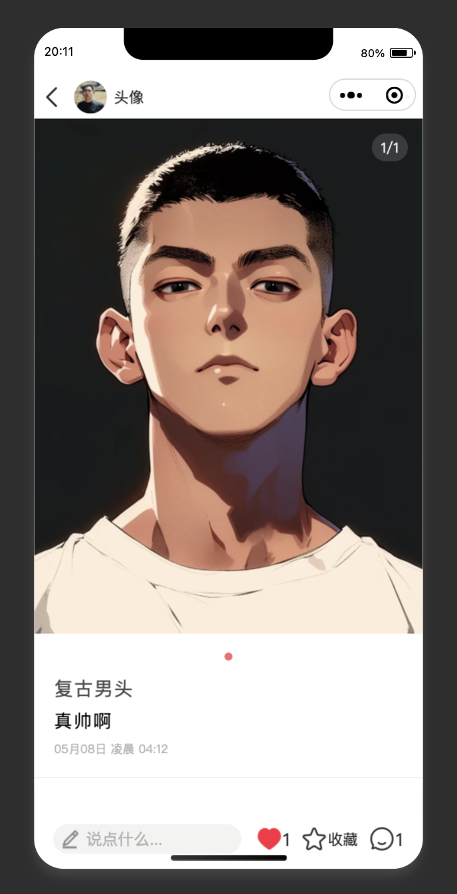

  

<h1 align="center" style="margin: 30px 0 30px; font-weight: bold;">HongShu</h1>

  <b>基于 SpringBoot + Vue 前后端分离的仿小红书项目</b>

  <i>一款高仿小红书的全栈开源项目，支持内容发布、社交互动、即时通讯等核心功能，适合全栈学习与实战。</i>

  
  
  

---

> **声明**  
> 本项目基于 Mit 协议，免费开源，仅供学习交流，禁止转卖，谨防受骗。如需商用请保留版权信息，确保合法合规使用，运营风险自负，与作者无关。

---

> **移动端通知**  
> 🎉 因移动端重构，原移动端可通过 `¥99` 获取学习

## 🚀 项目简介

基于 **SpringBoot + Vue3 + TypeScript** 前后端分离的**全栈仿小红书系统**，
1:1 还原小红书页面及核心功能，微服务架构演进版本。  
涵盖内容发布、社交互动、私信聊天、搜索发现等模块，致力于打造一个功能完善、体验流畅的社交分享平台。

### 📂 项目组成

| 模块 | 技术栈 | 地址 |
|------|--------|------|
| **[HongShu](https://gitee.com/Maverick_Ma/hongshu)** | SpringBoot | [Gitee](https://gitee.com/Maverick_Ma/hongshu) |
| **[HongShu-Web](https://gitee.com/Maverick_Ma/hongshu-web)** | Vue3 + Element Plus | [Gitee](https://gitee.com/Maverick_Ma/hongshu-web) |
| **[HongShu-Admin](https://gitee.com/Maverick_Ma/hongshu-admin)**  | Vue3 + Vite | [Gitee](https://gitee.com/Maverick_Ma/hongshu-admin) |
| **[HongShu-App](https://gitee.com/Maverick_Ma/hongshu-app)** | Uniapp | [Gitee](https://gitee.com/Maverick_Ma/hongshu-app) |

---

## 🌟 项目特色

| 功能模块        | 技术实现                      |
|----------------|-----------------------------|
| 智能推荐        | ElasticSearch + 协同过滤算法 |
| 即时通讯        | WebSocket + Netty           |
| 多存储方案      | 七牛云/阿里云/腾讯云OSS动态切换 |
| 高并发优化      | Redis + MQ 消息队列         |
| 安全认证        | 双Token无感刷新机制          |

---

## 📅 版本演进
> 💡 点击下方版本号可展开查看详细内容

<b>v1.0（当前开源版）</b>

- ES 智能查询、笔记随机推荐
- 笔记支持图文类型
- 本地存储、七牛云存储
- 审核机制

<b>v2.0</b>

- 新增 uniapp 移动端
- 笔记支持视频和 live 图类型
- 新增多种 OSS 存储方式，可动态配置
- 协同过滤算法推荐

<b>v3.0</b>

- 重构为 springCloud 微服务架构，Nacos 配置中心
- 新后台管理页面（Arco-Design）
- 引入高德地图
- 闲置商城购物功能
- Netty 重构消息聊天
- MQ+Redis 优化点赞、收藏、浏览

---

## 🏗️ 技术选型

- SpringBoot、SpringCloud、Nacos、Redis、ElasticSearch、MySQL
- 前端：Vue3、TypeScript、Element UI、Vite、uniapp
- 消息：WebSocket、Netty、MQ
- 存储：本地、Minio、七牛云、腾讯云、阿里云

> 系统架构图、详细技术栈请见[项目文档](https://mayongjian.cn)

---

## 📦 项目地址

- Gitee: [https://gitee.com/Maverick_Ma/hongshu](https://gitee.com/Maverick_Ma/hongshu)
- Github: [https://github.com/Ma-YongJian/HongShu](https://github.com/Ma-YongJian/HongShu)

---

## 📚 项目文档

- 文档及资料：[个人博客](https://mayongjian.cn)

---

## 🎬 视频演示

- [Bilibili 演示视频](https://www.bilibili.com/video/BV1QP8dekEGq/?spm_id_from=333.999.list.card_archive.click&vd_source=ec9224821314432ac6e12dc7d500d74b)

---

## 🌐 演示站（微服务版本-持续更新）

| 端口 | 入口 |
| :---: | :---: |
| Web端 | [点我进入](http://115.190.73.103) |
| 管理端 | [点我进入](http://115.190.73.103/admin/) |
| 移动端 | [点我进入](http://115.190.73.103/app/)    |

> 原移动端版本 `¥99` 可获取学习。
> 微服务版源码暂未开源，如需可添加微信获取👇  
> 

---

## 💖 打赏支持

感谢小伙伴们打赏支持，用于升级服务器❤️  

> **欢迎 Star & Fork 支持项目！如有问题或定制需求可微信联系作者。**

---

## 🙏 致谢

- [若依 RuoYi](https://gitee.com/y_project/RuoYi)
- [蘑菇博客](https://gitee.com/moxi159753/mogu_blog_v2)
- [xiaozhao 仿小红书前端](https://gitee.com/xzjsccz/xiaohongshu)
- 感谢 [七牛云](https://portal.qiniu.com/signup?utm_source=kaiyuan&utm_media=mogu) 提供的免费云存储和CDN服务
- 感谢 [jetbrains](https://www.jetbrains.com/?from=mogu_blog_v2) 提供的开源License
---

## 🛠️ 快速开始

详见[项目文档](https://mayongjian.cn)，或参考各子项目 README 进行本地部署体验。

---

## ❓ FAQ

- Q: 如何本地运行？
  A: 详见各子项目 README 或[项目文档](https://mayongjian.cn)。
- Q: 依赖环境有哪些？
  A: JDK 8+、Node 16+、MySQL 8+、Redis 6+ 、Elasticsearch 7+等。
- Q: 数据库脚本在哪里？
  A: 见后端项目 `doc/sql` 目录。

---

## 📷 演示图

### Web端

<table>
  <tr>
    <td></td>
    <td></td>
    <td></td>
  </tr>
  <tr>
    <td></td>
    <td></td>
    <td></td>
  </tr>
  <tr>
    <td></td>
    <td></td>
    <td></td>
  </tr>
  <tr>
    <td></td>
    <td></td>
    <td></td>
  </tr>
</table>

### 管理端

<table>
  <tr>
    <td></td>
    <td></td>
    <td></td>
  </tr>
  <tr>
    <td></td>
    <td></td>
    <td></td>
  </tr>
  <tr>
    <td></td>
    <td></td>
  </tr>
</table>

### App端

<table>
  <tr>
    <td></td>
    <td></td>
    <td></td>
    <td></td>
  </tr>
  <tr>
    <td></td>
    <td></td>
    <td></td>
    <td></td>
  </tr>
  <tr>
    <td></td>
    <td></td>
    <td></td>
    <td></td>
  </tr>
</table>
